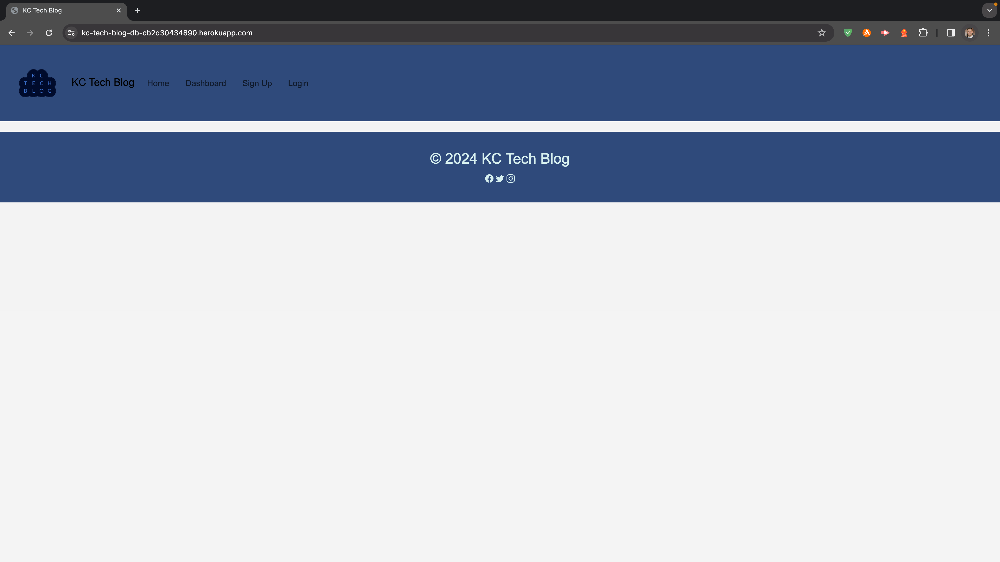

# Tech Blog

## Description
The Tech Blog is a web application that allows users to create, edit, and comment on blog posts related to technology. It provides a platform for tech enthusiasts to share their insights, experiences, and knowledge with the community.

## Features and Functionality
<b>User Authentication:</b> Users can sign up for an account or log in if they already have one. Authentication ensures that only registered users can create and interact with posts.

<b>Create and Edit Posts:</b> Authenticated users can create new blog posts and edit their existing posts. Each post includes a title, content, and the date of creation.

<b>Comment on Posts:</b> Users can comment on any blog post, providing a space for discussions and interactions among community members.

<b>User Profiles:</b> The application includes user profiles where users can view their own posts and comments. It also displays the date when a user joined the community.

## Technologies Used
Node.js: Backend JavaScript runtime.

Express.js: Web application framework for Node.js.

Sequelize: Promise-based Node.js ORM for MySQL.

MySQL: Relational database management system.

Express-Handlebars: View engine for Express applications.

Bcrypt.js: Library for hashing passwords.

Express-Session: Session middleware for Express.

Connect-Session-Sequelize: Sequelize-based session store.

dotenv: Environment variable management.

## Contributors
<b>Lead Developer:</b> Kenny Cummings

Tutor Armando Osorio provided valuable insights and guidance during the development process.

## Deployment Link
https://kc-tech-blog-db-cb2d30434890.herokuapp.com/

## Screenshot

